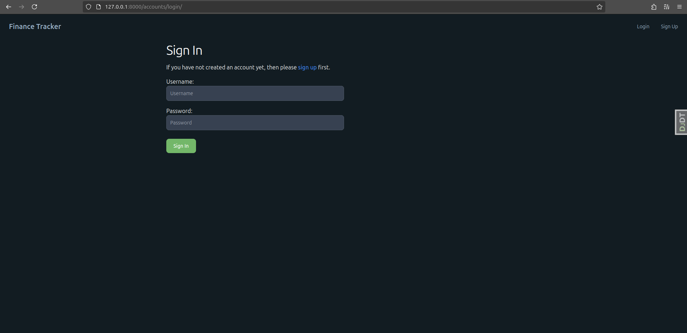
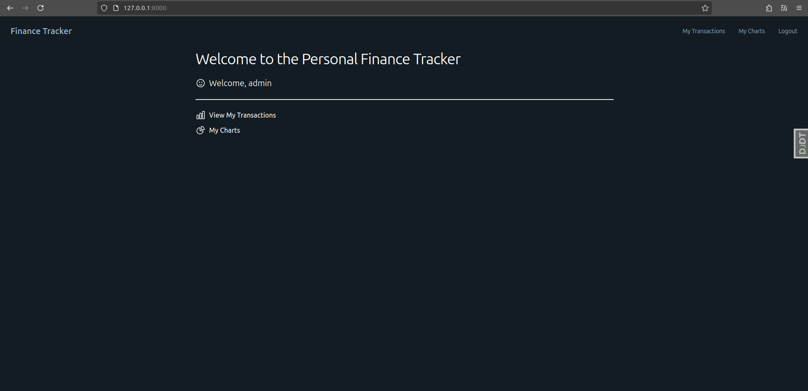

- [Finance App](#finance-app)
  - [Особенности](#особенности)
  - [Зависимости](#зависимости)
  - [Настройка и запуск с Docker](#настройка-и-запуск-с-docker)
  - [Конфигурация Docker](#конфигурация-docker)
  - [Скриншоты](#скриншоты)
  - [Лицензия](#лицензия)

# Finance App

Этот проект представляет собой веб-приложение для управления финансами, разработанное с использованием Django и HTMX.
Оно позволяет пользователям отслеживать доходы и расходы, а также получать общую картину своего финансового состояния.

## Особенности

* **Django Framework:** Веб-приложение построено на мощном и гибком фреймворке [Django](https://www.djangoproject.com/).
* **Управление транзакциями:** Возможность добавлять, редактировать и удалять транзакции с указанием типа (
  доход/расход), суммы и даты.
* **Импорт и Экспорт Транзакций:** Поддерживается импорт и экспорт транзакций в различных форматах (например, CSV,
  Excel).
* **Диаграммы и Визуализация:** На странице с диаграммами предоставляется наглядная визуализация финансовых данных с
  использованием [Plotly](https://plotly.com/).
* **Адаптивный дизайн:** Интерфейс оптимизирован для работы на различных устройствах.
* **Бесконечная прокрутка (Infinite scroll) с HTMX:** В приложении реализована бесконечная прокрутка для удобного просмотра больших объемов данных, используя мощь библиотеки [HTMX](https://htmx.org/).
* **Интеграция с Tailwind CSS:** Используется для стилизации с помощью плагинов и тем, включая [DaisyUI](https://daisyui.com/).
* **PostgreSQL Database:** Приложение использует [PostgreSQL](https://www.postgresql.org/) для хранения данных.
* **Контейнеризация с Docker:** Приложение и его зависимости упакованы в Docker-контейнеры для простого развертывания.
* **Использование Docker Compose:** Определение и запуск нескольких контейнеров с использованием Docker Compose.

## Зависимости

Проект использует следующие основные библиотеки и пакеты Python:

* **Django:** Основа веб-приложения.
* **Django Allauth:** Для аутентификации и управления пользователями.
* **Django Debug Toolbar:** Удобный инструмент для отладки запросов и шаблонов.
* **Django Filter:** Для создания фильтров на основе данных.
* **Django HTMX:** Для динамического обновления контента.
* **Django Import Export:** Для импорта и экспорта данных.
* **Django Tailwind:** Для интеграции Tailwind CSS.
* **Django Template Partials:** Для управления фрагментами шаблонов.
* **Django Widget Tweaks:** Для стилизации форм.
* **Plotly:** Для построения диаграмм и графиков.

Полный список зависимостей вы можете найти в файле `poetry.lock`.

## Настройка и запуск с Docker

1. **Установка Docker и Docker Compose:**

    * Убедитесь, что у вас установлены Docker и Docker Compose. [Инструкции](https://docs.docker.com/get-docker/)

2. **Настройка переменных окружения:**

    * Скопируйте примеры файлов `.env.*.example` и переименуйте их в `.env.*`.
    * Заполните все необходимые значения для подключения к вашей базе данных и другие необходимые параметры.
    * Обратите внимание, что есть отдельные файлы `.env` для web, pgadmin и базы данных.

   ```bash
   cp .env.db.example .env.db
   cp .env.web.example .env.web
   cp .env.pgadmin.example .env.pgadmin
   ```

3. **Сборка и запуск Docker контейнеров:**

   ```bash
   docker compose up --build
   ```

   Эта команда соберет образы Docker, если это необходимо, и запустит контейнеры.


4. **Создание и применение миграций:**

    * После запуска контейнеров необходимо создать и применить миграции базы данных, чтобы создать необходимые таблицы и
      обновить структуру базы данных. Для этого выполните следующие команды внутри контейнера `web`:

      ```bash
      docker compose exec web python manage.py makemigrations
      docker compose exec web python manage.py migrate
      ```

5. **Доступ к приложению:**

    * Веб-приложение будет доступно по адресу `http://localhost:8000`.
    * pgAdmin будет доступен по адресу `http://localhost:8888`.


## Конфигурация Docker

* **Dockerfile:** Использует многоступенчатую сборку с базовым образом `python:3.12` и устанавливает все необходимые
  зависимости.
* **docker-compose.yml:** Настраивает сервисы `web` (Django-приложение), `db` (PostgreSQL) и `pgadmin`.

## Скриншоты

1. Создание аккаунта:<br>
    
2. Вход в аккаунт:<br>
   
3. Главная страница:<br>
   
4. Страница с транзакциями:<br>
   
5. Добавление транзакции:<br>
   
6. Обновление транзакции:<br>
   
7. Импортирование транзакций:<br>
   
8. Страница с диаграммами:<br>
   

## Лицензия

Этот проект распространяется под лицензией MIT.

Полный текст лицензии доступен в файле [LICENSE](LICENSE).
